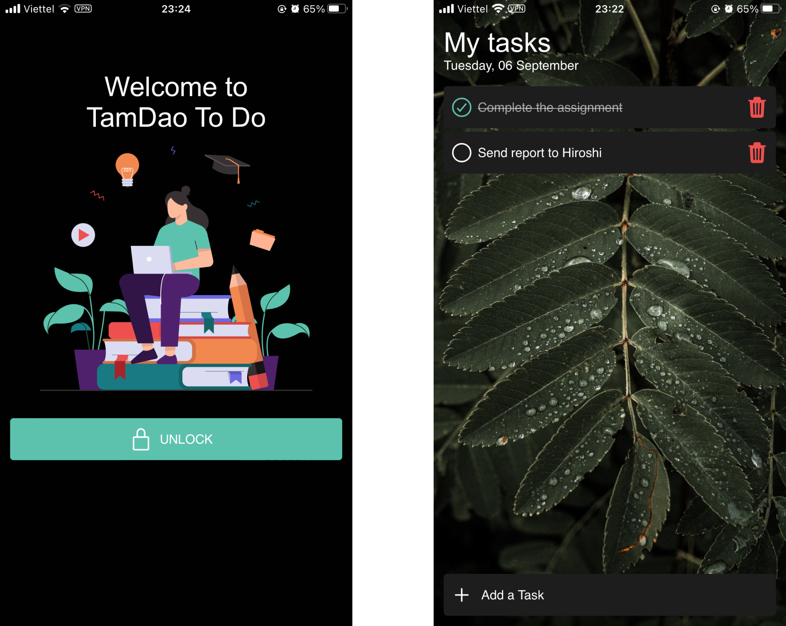

# TamDao To Do Application

<p align="center">
  <h2 align="center">Typescript, Expo, React Navigation, Redux Toolkit, Redux Persist, i18n-js ⚡️</h2>
</p>



## Features

Few things you can do with TamDao To Do:

- ✅ Use FaceID and TouchID (iOS) or the Biometric Prompt (Android) to unlock
- ✅ Add, remove, mark done task
- ✅ Support EN, JA, VI lang base on the device

## Structure

This project's structure will look like this:

```
├── app
│   ├── components
│   ├── i18n
│   ├── navigators
│   ├── screens
│   ├── store
│   ├── theme
├── README.md
├── app.json
└── package.json
```

**components**
This is where your React components will live. Each component will have a directory containing the `.tsx` file

**i18n**
This is where your translations will live.

**navigators**
This is where your `react-navigation` navigators will live.

**screens**
This is where your screen components will live. A screen is a React component which will take up the entire screen and be a part of the navigation hierarchy. Each screen will have a directory containing the `.tsx` file, along with any components or slice or test or assets or other helper files.

**store**
This is where your `redux-tookit` will live, contains each global slice or config

**theme**
Here is the themes for application, including spacing, color, and font.

## Build Process

- Follow the [Expo Guide](https://docs.expo.dev/get-started/installation/) to get started building a project. **A Mac is required if you wish to develop for iOS.**
- `yarn` to install dependencies
- `yarn start` to start the packager
- `yarn ios` to start the packager and run the app in the iOS simulator.
- `yarn android` to start the packager and run the app in the the Android device/emulator.
- `yarn test` to run test.
